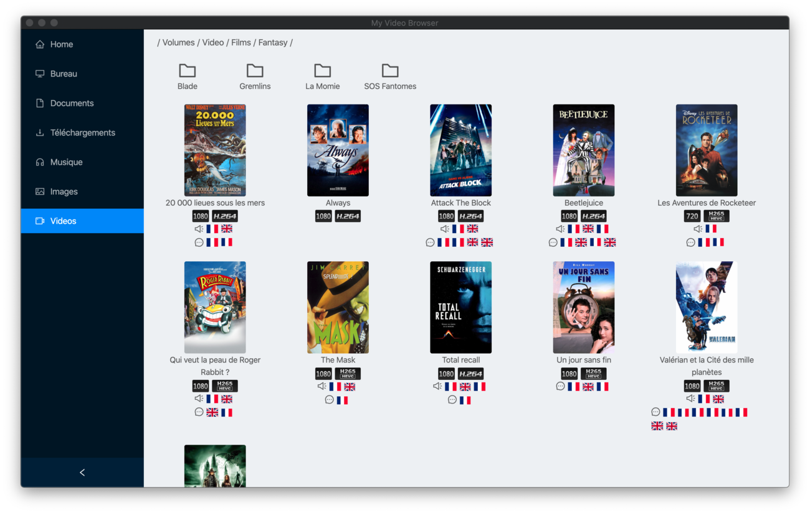
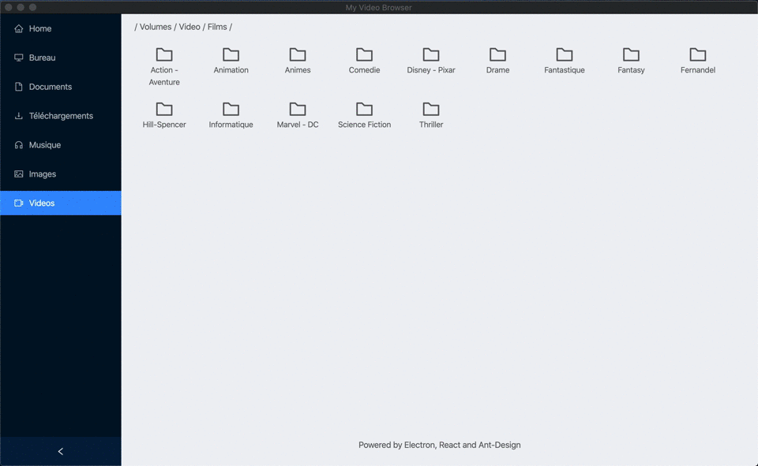

# Electron Video Browser

## Presentation 

This project is just a playground I built to discover [Electron](https://www.electronjs.org/) through a [React](https://reactjs.org) app.

It lists movies from the file system, extract their informations (codec, quality...) using ffprobe (ffmpeg) and shows covers from TMDB.

It uses those libraries:
-  [React](https://reactjs.org)
-  [Ant Design](https://ant.design)
-  [FFmpeg](https://ffmpeg.org/) to extract video informations (codec...)
-  [The Movie DataBase](https://www.themoviedb.org) to get movie covers
-  [Parcel](https://parceljs.org/) to bundle the React application
-  [Electron](https://www.electronjs.org/)
-  [Electron-builder](https://www.electron.build/) to pack the application

### Notice

My goal was to test electron, not to provide a real app. I limited my test to my laptop.
Works on my MacBook Pro, on macOS Catalina, version 10.15.5

## Installation

    yarn
    
## Development

Build the application using:

    yarn build

Start it using:

    yarn start
    
or Watch it using:

    yarn watch
  
## Build a distribuable package

    yarn build-app

## Screencast

